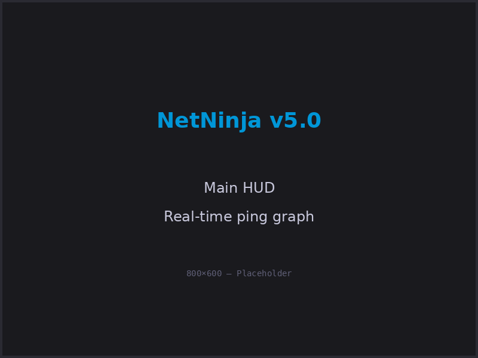
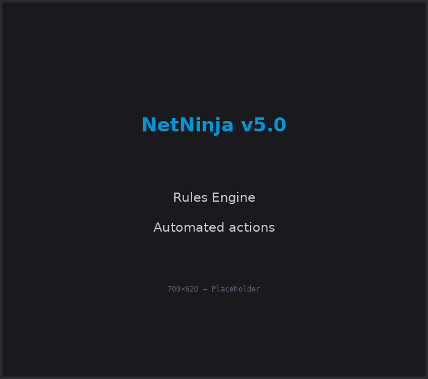
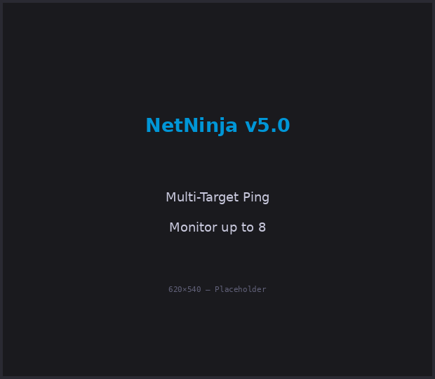
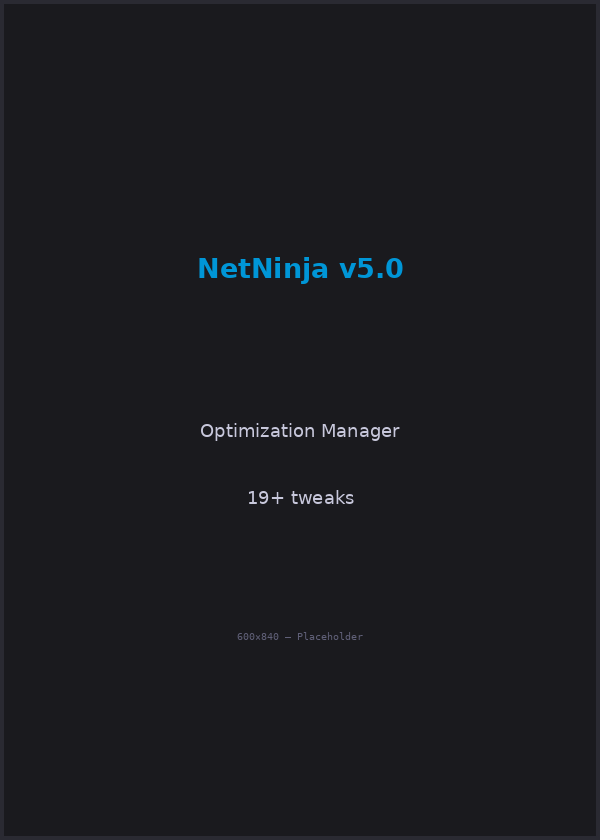
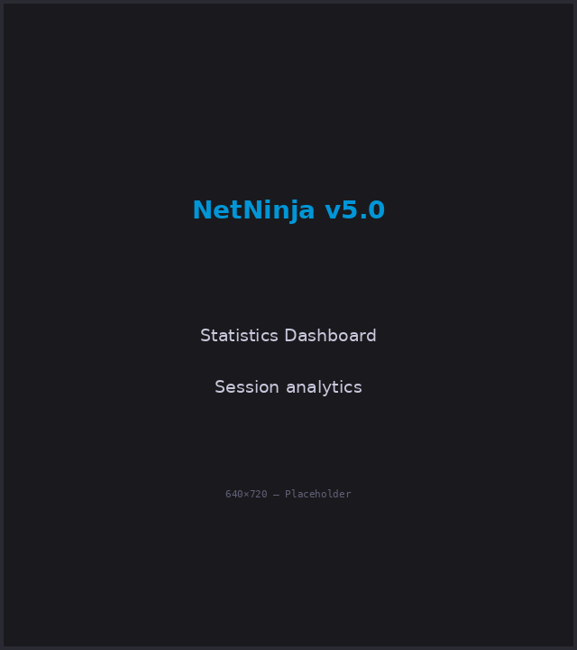
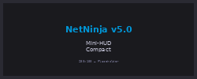
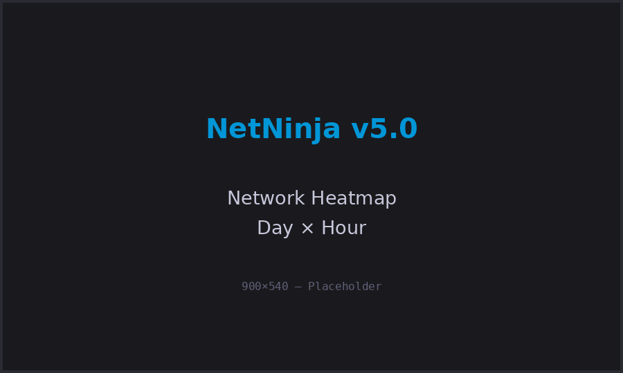
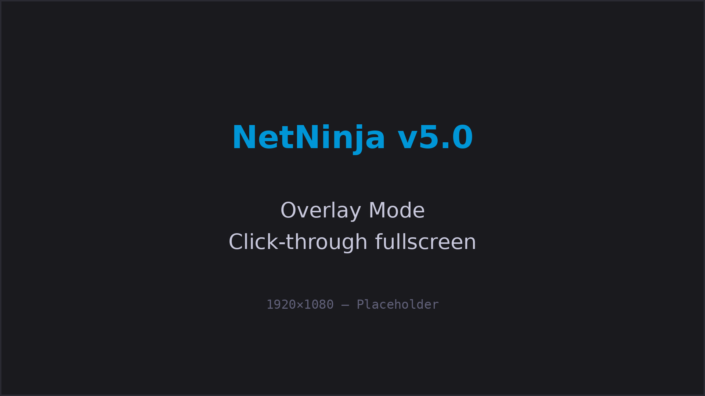

# 🥷 NetNinja v5.0
**Network Latency Monitor & Optimizer for Windows — PowerShell 5.1+**

> Real-time ping monitoring, network optimization, and game server auto-detection — all in a single portable `.ps1` file.

[](LICENSE)
[](https://github.com/PowerShell/PowerShell)
[](https://www.microsoft.com/windows)

---

## 📸 Screenshots

<table>
<tr>
<td width="50%">

### Main HUD

*Real-time ping graph with adaptive timeframes*

</td>
<td width="50%">

### Rules Engine

*Automated actions based on ping/loss thresholds*

</td>
</tr>
<tr>
<td width="50%">

### Multi-Target Ping

*Monitor up to 8 targets simultaneously*

</td>
<td width="50%">

### Optimization Manager

*19+ registry & TCP tweaks with one click*

</td>
</tr>
<tr>
<td width="50%">

### Statistics Dashboard

*Session analytics with stability scoring*

</td>
<td width="50%">

### Mini-HUD Overlay

*Always-on-top compact display*

</td>
</tr>
</table>

<details>
<summary><b>More Screenshots</b></summary>

### Network Heatmap

*Ping patterns by day/hour over weeks*

### Overlay Mode

*Click-through fullscreen overlay for gaming*

</details>

---

## ✨ Features

<table>
<tr>
<td width="33%">

**🎯 Monitoring**
- Real-time ping graph (60s / 5min / 30min / 1h)
- Packet loss tracking
- Jitter & spike detection
- Timeline of network events
- Session history (last 50)
- Ping heatmap (day × hour)

</td>
<td width="33%">

**⚙️ Optimization**
- 19 base network tweaks
- 10 competitive-specific (FPS profile)
- MTU auto-optimizer
- DNS switcher (Cloudflare/Google)
- Adapter selector
- Power plan switching

</td>
<td width="33%">

**🎮 Gaming**
- 103 game auto-detect
- Server IP auto-detection
- Failover on disconnect
- Discord Rich Presence
- 4 profiles (MMO/FPS/Analysis/Silent)
- Overlay mode (click-through)

</td>
</tr>
<tr>
<td width="33%">

**🤖 Automation**
- Rules engine (9 action types)
- Webhook alerts (Discord/Slack/Teams)
- Auto-reconnect
- Adaptive ping rate (1s–5s)
- Sound profiles (custom MP3/WAV)
- Auto-diagnosis (buffer bloat, ISP issues)

</td>
<td width="33%">

**📊 Analysis**
- A/B benchmark (before/after)
- Traceroute with hop coloring
- GeoIP with world map
- Speed test
- Export: CSV, HTML, PNG
- Detailed logging

</td>
<td width="33%">

**🎨 Interface**
- Mini-HUD (always-on-top)
- Multi-target (up to 8)
- Dark/Light theme
- Global hotkeys (Ctrl+Alt+...)
- System tray integration
- Fully portable (single .ps1)

</td>
</tr>
</table>

---

## 🚀 Quick Start

### Requirements
- **Windows 10 / 11**
- **PowerShell 5.1+** (pre-installed)
- **Administrator rights** (auto-elevates)

### Installation

**Option 1: One-Click (Recommended)**
1. Download [NetNinja.ps1](https://github.com/Patbeck85/NetNinja/releases/latest)
2. Right-click → **Run with PowerShell**
3. Done! 🎉

**Option 2: With Installer**
```powershell
# Clone or download this repository
git clone https://github.com/Patbeck85/NetNinja.git
cd NetNinja

# Create desktop shortcut with Admin flag
.\scripts\Install.ps1

# Double-click the desktop shortcut to launch
```

### First Launch
1. NetNinja **auto-detects your game server** via active TCP connections
2. Or manually enter server IP/port in the HUD
3. Select a **profile**: MMO / FPS / Analysis / Silent
4. Optionally apply **network optimizations** from Optimization Manager

---

## ⌨️ Keyboard Shortcuts

| Shortcut | Action |
|---|---|
| `Ctrl+Alt+P` | Toggle HUD show/hide |
| `Ctrl+Alt+O` | Toggle Overlay mode (fullscreen click-through) |
| `Ctrl+Alt+R` | Reset statistics |
| `Ctrl+Alt+M` | Open MTU Optimizer |
| `Ctrl+Alt+S` | Save config |
| `Ctrl+Alt+H` | Export HTML report |

---

## 📋 Profiles

| Profile | Use Case | Ping Rate | Alerts | Optimizations |
|---|---|---|---|---|
| **MMO** | WoW, FFXIV, Ragnarok, BDO, PoE | 2s | High + Loss | Base tweaks |
| **FPS** | CS2, Valorant, Apex, R6 Siege | 1s | All | Full competitive |
| **Analysis** | Diagnostics, ISP troubleshooting | 1s | All + verbose logs | None |
| **Silent** | Background monitoring | 5s | None | None |

Profiles bundle settings and auto-apply on switch. Create custom profiles by editing `netninja_config.json`.

---

## 🎯 Use Cases

### For Gamers
- Monitor **server ping in real-time** while gaming
- Get **alerts before lag spikes** ruin your matches
- **Auto-optimize** network settings for FPS/MMO
- **Overlay mode**: see ping without alt-tabbing

### For Streamers
- Monitor **connection stability** during streams
- **Auto-failover** to backup server on disconnect
- **Webhook alerts** to Discord when issues occur
- **Mini-HUD** overlay for on-screen stats

### For Network Admins
- **Diagnose ISP issues** (buffer bloat, congestion)
- **Traceroute** with hop timing
- **Heatmap** to identify peak-hour problems
- **Export reports** (CSV/HTML) for ISP tickets

---

## 🔧 Configuration

NetNinja saves config to `netninja_config.json`. Key settings:

```json
{
  "ServerAddress": "your.server.ip",
  "ServerPort": 5121,
  "AlertHighPing": 150,
  "AlertCriticalPing": 300,
  "AdaptiveRate": true,
  "CurrentProfile": "MMO"
}
```

See **[docs/CONFIGURATION.md](docs/CONFIGURATION.md)** for all options.

---

## 🛡️ Safety & Permissions

NetNinja requests **Administrator rights** to:
- Apply TCP/registry optimizations
- Change DNS settings
- Restart network adapters

### All changes are reversible:
- **Registry**: Auto-backed up before first modification
- **Network**: Backup created before DNS changes
- **Uninstall**: `scripts/Uninstall.ps1` restores everything

No data is sent to external servers (except optional webhooks you configure).

---

## 📖 Documentation

- **[CONFIGURATION.md](docs/CONFIGURATION.md)** — All config options explained
- **[TROUBLESHOOTING.md](docs/TROUBLESHOOTING.md)** — Common issues & fixes
- **[CONTRIBUTING.md](docs/CONTRIBUTING.md)** — Code guidelines for contributors
- **[GITHUB_SETUP.md](GITHUB_SETUP.md)** — How to publish to GitHub
- **[SCREENSHOTS.md](docs/SCREENSHOTS.md)** — Screenshot creation guide
- **[CHANGELOG.md](CHANGELOG.md)** — Version history

---

## 🧪 Testing

Run unit tests:
```powershell
.\tests\Test-Functions.ps1
```

Tests cover:
- Ping color calculation
- Jitter computation (MAD)
- Stability scoring
- DNS/IP validation
- Private IP filtering

---

## 🤝 Contributing

Contributions are welcome! See **[CONTRIBUTING.md](docs/CONTRIBUTING.md)**.

**Quick start:**
1. Fork the repository
2. Create a feature branch: `git checkout -b feature/my-feature`
3. Commit your changes: `git commit -m 'feat: Add my feature'`
4. Push: `git push origin feature/my-feature`
5. Open a Pull Request

---

## 📜 Changelog

See **[CHANGELOG.md](CHANGELOG.md)** for version history.

### Latest: v5.0.0 (2026-02-16)
- **49 bug fixes** (memory leaks, threading, validation)
- Rules Engine with 9 action types
- Multi-Target Ping (up to 8 targets)
- Auto-Diagnosis (buffer bloat, ISP congestion detection)
- Webhook alerts (Discord/Slack/Teams)
- Session History (last 50 sessions)
- Ping Heatmap (persistent)

---

## 📄 License

MIT License — see **[LICENSE](LICENSE)** for details.

---

## ⚠️ Disclaimer

Network optimizations modify Windows registry and TCP settings. While all changes are backed up and reversible, **use at your own risk**. NetNinja is not affiliated with any game publisher or ISP.

---

## 🌟 Star History

If you find NetNinja useful, give it a ⭐ on GitHub!

---

## 📞 Support

- **Issues**: [GitHub Issues](https://github.com/YourUsername/NetNinja/issues)
- **Discussions**: [GitHub Discussions](https://github.com/YourUsername/NetNinja/discussions)
- **Email**: your@email.com

---

<div align="center">

**Made with 🥷 by [YourName](https://github.com/YourUsername)**

</div>
